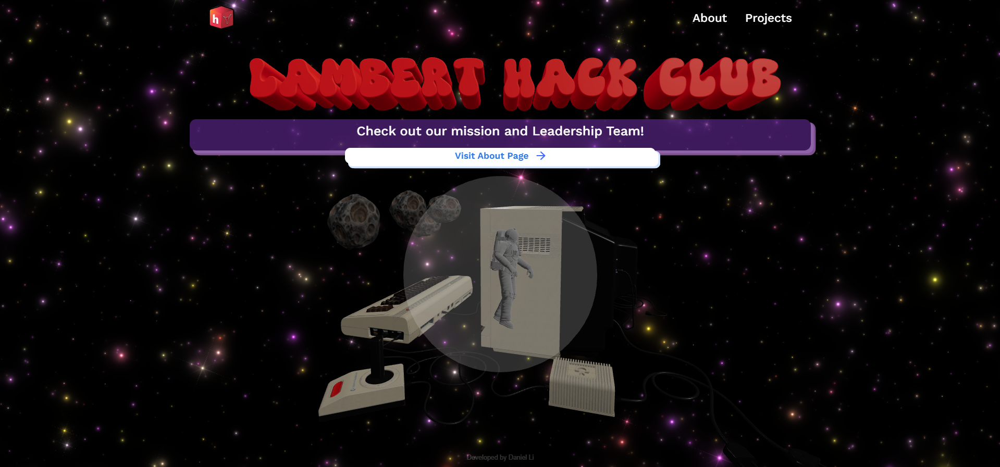

# 3d-Galaxy-HackClub-Website

3D website starter built over the span of around 30-40 hours for Lambert's Hack Club using React, Tailwind CSS, and Three.js.  

Note: the website pages don't actually have anything on them because I'm not sure if you guys want to still use the original Hack Club website's UI for the pages and I don't actually have access to the repo so it wouldn't be that efficient. Also I ran out of time.  

# Website Image

## Acknowledgments

  - Astronaut 3D model by LasquetiSpice from [SketchFab](https://sketchfab.com/3d-models/animated-floating-astronaut-in-space-suit-loop-e2c4b146e58141e4b87917456a9970b1)
  - Computer 3D model by dark_igorek from [SketchFab](https://sketchfab.com/3d-models/commodore-64-computer-full-pack-1f43612fa2d54041bbe2bdff8164c2cd)
  - Asteroid 3d model by Game Piggs from [SketchFab](https://sketchfab.com/3d-models/asteroid-2b-game-model-37fe10832d654463bfd0094167c10a2a)
  - 3d Lambert Hack Club text created by me from Blender
  - Splash Cursor from [ReactBits](https://www.reactbits.dev/animations/splash-cursor)
  - Galaxy Background from [ReactBits](https://www.reactbits.dev/backgrounds/galaxy)
  - Normalized Rotation Script and Debugging from ChatGPT

